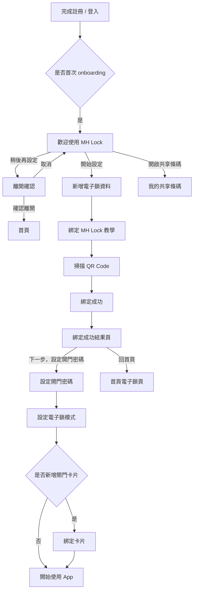
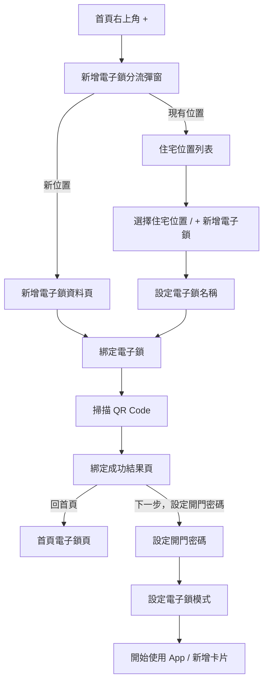

# OpenSpec｜0.4 Onboarding 與電子鎖新增流程開發文檔

> 文件版本：v1.5  
> 來源文件：`0.4_On boarding_update.pdf`、`電子鎖新增流程.pdf`  
> 適用端：MH Lock App（個人電子鎖 / 房東電子鎖首頁）  
> 規格目的：定義新使用者首次 onboarding、首次綁定電子鎖、首頁新增電子鎖、現有位置新增電子鎖、綁定成功結果頁後續設定流程。
on boarding 流程
https://www.figma.com/design/eAQc8TvdPeOnRFTJr5IgnE/%E5%80%8B%E4%BA%BA%E7%AB%AF-App?node-id=7055-109826&t=0C3anG7eQRwxHOBe-4
首頁-新增電子鎖流程
https://www.figma.com/design/eAQc8TvdPeOnRFTJr5IgnE/%E5%80%8B%E4%BA%BA%E7%AB%AF-App?node-id=7055-109638&t=0C3anG7eQRwxHOBe-4

---

## 1. Scope

### 1.1 本文件涵蓋

1. 新使用者註冊 / 登入後的首次 onboarding 引導。
2. 首次新增電子鎖流程。
3. 首次綁定後的後續設定：
   - 設定開門密碼。
   - 設定電子鎖模式。
   - 選擇是否新增開門卡片。
4. 從首頁右上角「+」新增電子鎖流程。
5. 新增電子鎖時選擇：
   - 新位置。
   - 現有位置。
6. 電子鎖位置 / 電子鎖名稱 / 敘述 / 房間圖片資料輸入。
7. 掃描 QR Code 綁定電子鎖。
8. 綁定電子鎖時辨識電子鎖型號，並顯示對應說明圖與成功文案。
9. 綁定成功後回首頁與卡片顯示。
10. 同住成員加入已設定好的 MH Lock 的入口與共享條碼入口。

### 1.2 本文件不涵蓋

1. 帳號註冊 / 登入本身的完整規格。
2. Google / LINE / Apple 登入串接細節。
3. NFC 綁定卡片底層實作。
4. 電子鎖硬體韌體的 QR Code 產生規格。
5. 電子鎖斷線、離線、OTA、低電量通知完整規格。
6. 租賃版房源 / 房間 / 租約下的電子鎖綁定規格。
7. 電子鎖更換流程的完整規格；本文件僅說明更換電子鎖時是否顯示 onboarding 教學頁。
8. 電子鎖解除綁定的「保留資料 / 清除資料」完整規格，另案處理。

---

## 2. 名詞定義

| 名詞 | 定義 |
|---|---|
| 住宅位置 | 使用者建立的居住 / 管理位置，例如「台北我家」、「桃園老家」。同一位置下可有多把電子鎖。 |
| 電子鎖 | MH Lock 裝置，可被綁定至使用者 App，並顯示於首頁電子鎖卡片。 |
| 首次 onboarding | 使用者完成註冊 / 登入後，第一次進入電子鎖設定流程時顯示的引導頁。 |
| 新位置 | 新增電子鎖時，同時建立一個新的住宅位置。 |
| 現有位置 | 新增電子鎖時，選擇已存在的住宅位置，僅新增該位置底下的一把電子鎖。 |
| 綁定條碼 / QR Code | 電子鎖硬體畫面上顯示的綁定用 QR Code。App 掃描後完成電子鎖與帳號綁定。 |
| 電子鎖型號 | 電子鎖硬體型號，於綁定時辨識。支援 `mini`、`standard`、`pro` 三種型號。 |
| 開門密碼 | 電子鎖的數字開門密碼。預設值為 `000000`，綁定後需引導使用者更改。 |
| 電子鎖模式 | 電子鎖感應模式，包含「節能待機模式」與「即時感應模式」。 |

---

## 3. 角色與前置條件

### 3.1 角色

| 角色 | 說明 |
|---|---|
| 擁有者 | 建立住宅位置並綁定電子鎖的使用者。可新增電子鎖、設定密碼、設定模式、分享條碼給親友。 |
| 同住成員 | 透過擁有者分享的 QR Code 加入已設定好的 MH Lock。 |

### 3.2 前置條件

使用者進入新增電子鎖流程前，需具備：

1. 已完成 App 帳號登入。
2. 已擁有 MH Lock 電子鎖。
3. 電子鎖已開機。
4. 電子鎖可連上 Wi-Fi。
5. 若要綁定卡片，iOS 僅支援官網購買之專用卡片；其他卡種（如悠遊卡、一卡通、門禁卡）請使用 MH Lock 電子鎖主機綁卡，或透過 Android 手機進行綁定。

---

## 4. 入口與流程分流

### 4.1 首次登入後入口

當使用者完成註冊 / 登入後，若帳號尚未完成首次 onboarding，系統顯示 `歡迎使用 MH Lock` 引導頁。

引導頁內容：

- 標題：`歡迎使用 MH Lock`
- 內文：
  - 接下來將開始設定電子鎖與綁定卡片。
  - 此過程約會花費五分鐘。
  - 請確認已準備好清單中的項目。
- 準備清單：
  1. MH Lock 電子鎖。
  2. 可連線的 Wi-Fi 環境。
  3. 悠遊卡 / 一卡通。
- 主按鈕：`開始設定`
- 次按鈕：`稍後再設定`
- 共享入口：
  - 文字：`加入親友已設定好的 MH Lock？`
  - 按鈕：`開啟共享條碼`

### 4.2 首次 onboarding 顯示規則

1. `歡迎使用 MH Lock` onboarding 引導頁只在首次綁定流程出現一次。
2. 首次 onboarding 的完成判定為「完成第一把電子鎖綁定」。
3. 使用者僅看過歡迎頁、點擊 `開始設定`、設定密碼 / 模式 / 卡片，皆不作為 onboarding 完成判定。
4. 使用者若從首頁右上角「+」新增電子鎖，不再顯示 onboarding 教學頁。
5. 使用者執行更換電子鎖流程時，不再顯示 onboarding 教學頁。
6. 非首次流程應直接進入 scanner 或新增電子鎖資料流程。

### 4.3 首頁右上角「+」入口

使用者於首頁點擊右上角「+」後，顯示新增電子鎖分流彈窗。

彈窗內容：

- 標題：`新增電子鎖`
- 內文：`請選擇電子鎖要綁定在哪一個位置上`
- 選項：
  - `新位置`
  - `現有位置`

分流規則：

| 選項 | 後續流程 |
|---|---|
| 新位置 | 進入新增電子鎖資料頁，需填寫電子鎖位置與電子鎖名稱。 |
| 現有位置 | 進入住宅位置列表，選擇要新增電子鎖的位置後，只需設定電子鎖名稱。 |

---

## 5. 首次 onboarding 流程

### 5.1 流程總覽



### 5.2 稍後再設定

使用者於 onboarding 頁點擊 `稍後再設定` 時，需顯示離開確認。

確認內容：

- 標題：`確定要離開設定電子鎖流程？`
- 內文：`您可於首頁「+」再開始設定電子鎖。`
- 按鈕：
  - `取消`
  - `稍後再設定`

點擊 `稍後再設定` 後：

1. 關閉 onboarding 流程。
2. 進入首頁。
3. 首頁不需要持續顯示提醒卡片。
4. 不需要提供可關閉的提醒卡片，也不需要只顯示一次的提醒卡片。
5. 使用者後續可從首頁右上角「+」再次進入新增電子鎖流程。

### 5.3 加入親友已設定好的 MH Lock

使用者於 onboarding 頁點擊 `開啟共享條碼` 後，進入 `我的共享條碼` 頁。

頁面內容：

- 標題：`我的共享條碼`
- 說明：`掃描我的 QR Code，與我共用 MH Lock 電子鎖。`
- 行為：
  - 顯示使用者的共享 QR Code。
  - 此 QR Code 用途為「親友掃描我的條碼」加入我已設定好的 MH Lock。
  - 提供分享功能。
  - 可返回 onboarding / 首頁。

---

## 6. 新增電子鎖資料頁

### 6.1 新位置新增電子鎖

當使用者選擇 `新位置` 或首次 onboarding 進入新增電子鎖流程時，顯示新增電子鎖資料頁。

頁面標題：`新增電子鎖`

頁面說明：`請為您的 MH Lock 設定一個住宅位置與電子鎖名稱。`

欄位：

| 欄位 | 必填 | 格式 / 上限 | 預設值 | 說明 |
|---|---:|---|---|---|
| 電子鎖位置 | 是 | 1 - 20 字 | `我的家` | 建立住宅位置名稱。 |
| 電子鎖名稱 | 是 | 1 - 20 字 | `大門鎖` 或系統預帶名稱 | 建立該位置下的電子鎖名稱。 |
| 敘述 | 否 | 0 - 100 字 | 空 | 住宅 / 電子鎖補充說明。 |
| 房間圖片 | 否 | 圖片上傳 | 空 | 用於住宅 / 電子鎖卡片顯示。 |

主按鈕：`下一步，綁定電子鎖`

名稱規則：

1. 同一住宅位置下允許多把電子鎖使用相同名稱。
2. 因允許同名，不需顯示重複名稱錯誤文案。
3. 電子鎖名稱預帶規則為「依同一住宅位置下既有電子鎖數量自動累加」。
   - 該位置尚無電子鎖時，預帶 `大門鎖`。
   - 該位置已有 1 把電子鎖時，預帶 `大門鎖2`。
   - 該位置已有 2 把電子鎖時，預帶 `大門鎖3`，依此類推。
4. 預帶名稱僅為前端建議值，使用者可自行改成既有名稱。
5. `房間圖片` 欄位名稱不需修改，正式命名仍維持 `房間圖片`。

### 6.2 現有位置新增電子鎖

當使用者選擇 `現有位置` 後，顯示住宅位置列表。

列表規則：

1. 依住宅位置分組顯示。
2. 每個住宅位置顯示：
   - 住宅位置名稱。
   - 地址或敘述資訊。
   - 已存在的電子鎖名稱。
   - 每把電子鎖的狀態。
   - `+ 新增電子鎖` 入口。
3. 已綁定的電子鎖顯示狀態：`已綁定`。
4. 本文件不支援草稿功能，因此列表不顯示未完成綁定的 `前往綁定` 續綁入口。
5. 過長的住宅位置名稱、地址、電子鎖名稱需以省略號截斷。

使用者點擊某住宅位置下的 `+ 新增電子鎖` 後，進入現有位置新增電子鎖資料頁。

頁面標題：`新增電子鎖`

頁面說明：`請設定電子鎖的名稱。`

欄位：

| 欄位 | 狀態 | 說明 |
|---|---|---|
| 電子鎖位置 | 唯讀 / 已帶入 | 顯示既有住宅位置名稱，不可改為其他位置。 |
| 電子鎖名稱 | 必填 | 預設帶入系統建議名稱，例如 `大門鎖3`。 |
| 敘述 | 沿用既有位置 | 沿用該住宅位置既有敘述，不在此流程建立每把電子鎖的獨立敘述。 |
| 房間圖片 | 沿用既有位置 | 沿用該住宅位置既有圖片，不在此流程建立每把電子鎖的獨立圖片。 |

主按鈕：`下一步，綁定電子鎖`

---

## 7. 綁定電子鎖流程

### 7.1 綁定前教學頁

首次 onboarding 流程中，需顯示綁定 MH Lock 的教學頁。

正式流程採 `1/3` 版本，依序顯示三個教學頁：

| 步驟 | 標題 | 說明 |
|---|---|---|
| 1/3 | 綁定 MH Lock 1/3 | 請確認 MH Lock 的電源已開啟，綠燈閃爍。 |
| 2/3 | 綁定 MH Lock 2/3 | 請點選電子鎖上的設定，進入電子鎖管理介面；管理密碼預設為 `0000`。請確認 MH Lock 已連上 Wi-Fi，若已連線，設備畫面會顯示已連線或設備燈會閃爍綠燈。 |
| 3/3 | 綁定 MH Lock 3/3 | 選擇 `綁定條碼`，並使用 MH Lock App 掃描設備顯示的 QR Code 完成綁定。 |

### 7.2 教學頁顯示規則

| 入口 | 是否顯示教學頁 | 後續 |
|---|---:|---|
| 首次 onboarding | 是 | 依序顯示教學步驟，再進入掃描。 |
| 首頁右上角「+」新增電子鎖 | 否 | 直接進入 scanner 或綁定頁。 |
| 更換電子鎖 | 否 | 直接進入 scanner。 |

### 7.3 綁定方式限制

本文件之電子鎖綁定僅支援掃描電子鎖硬體顯示的 QR Code。

規則：

1. App 綁定流程只提供掃描 QR Code，不提供其他綁定入口。
2. 使用者無法掃描 QR Code 時，需回到電子鎖硬體端重新產生或顯示綁定 QR Code 後再掃描。
3. 綁定流程不定義其他識別碼輸入、查詢或錯誤文案。

### 7.4 掃描 QR Code 與型號辨識

掃描電子鎖硬體顯示的 QR Code 後，App 需辨識本次綁定的電子鎖型號。

型號支援範圍：

- `mini`
- `standard`
- `pro`

規則：

1. App 掃描到有效 QR Code 後，需透過 QR Code payload 或綁定 API 驗證結果取得電子鎖型號。
2. 電子鎖型號為本次綁定流程必要資訊，供綁定成功結果頁顯示對應文案與說明圖。
3. 綁定流程中的說明圖需依辨識出的電子鎖型號切換為對應版本。
4. 若尚未完成 QR Code 驗證前無法取得型號，綁定前教學頁可顯示通用圖；一旦辨識完成，後續頁面需切換為對應型號圖。
5. 若無法辨識電子鎖型號，視為綁定失敗，不得以未知型號完成綁定。

型號對應文案：

| 型號 | 成功文案 |
|---|---|
| mini | `MH Lock Mini 已綁定至手機上，現在可以用手機操作電子鎖了！` |
| standard | `MH Lock Standard 已綁定至手機上，現在可以用手機操作電子鎖了！` |
| pro | `MH Lock Pro 已綁定至手機上，現在可以用手機操作電子鎖了！` |

型號對應說明圖規則：

1. `mini` 顯示 Mini 專用說明圖。
2. `standard` 顯示 Standard 專用說明圖。
3. `pro` 顯示 Pro 專用說明圖。
4. 說明圖需與實際綁定型號一致，不可混用。

### 7.5 綁定成功結果頁

掃描 QR Code 且後端驗證成功後，顯示綁定成功結果頁。

結果頁內容：

- 標題：`新增電子鎖`
- 顯示住宅位置與電子鎖名稱。
- 顯示已辨識的電子鎖型號對應說明圖。
- 成功文案依電子鎖型號切換：
  - `mini`：`MH Lock Mini 已綁定至手機上，現在可以用手機操作電子鎖了！`
  - `standard`：`MH Lock Standard 已綁定至手機上，現在可以用手機操作電子鎖了！`
  - `pro`：`MH Lock Pro 已綁定至手機上，現在可以用手機操作電子鎖了！`
- 後續操作區：`下一步，設定開門密碼`

後續操作區規則：

1. `下一步，設定開門密碼` 只顯示在綁定成功結果頁，不屬於首頁提示。
2. 使用者點擊 `下一步，設定開門密碼` 後，進入設定開門密碼流程。
3. 使用者點擊 `回首頁` 後，返回首頁電子鎖 Tab。
4. 使用者離開綁定成功結果頁後，不再於首頁顯示 `下一步，設定開門密碼`。
5. 首頁僅顯示電子鎖卡片，例如 `點擊解鎖`、電子鎖狀態、電量與連線狀態。
6. 若使用者未在結果頁完成開門密碼、電子鎖模式或卡片設定，後續仍可從電子鎖管理頁手動進入相關設定。
7. 本文件不定義首頁持續提醒卡片，也不定義首頁曝光次數限制。
8. 設計稿中若出現 `複製資料` 入口，不納入本文件範圍，流程與失敗處理另案定義。

綁定成功資料寫入規則：

1. 完成綁定後，電子鎖寫入正式電子鎖資料。
2. 寫入資料需包含已辨識出的電子鎖型號。
3. 新綁定的電子鎖出現在該住宅位置的電子鎖卡片中。
4. 若同位置有多把電子鎖，首頁卡片可左右滑動切換電子鎖。
5. 回到首頁後，預設可定位至新綁定的電子鎖卡片。

---

## 8. 首頁電子鎖卡片顯示

### 8.1 電子鎖卡片資訊

首頁電子鎖卡片需顯示：

| 區塊 | 顯示內容 |
|---|---|
| 住宅資訊 | 住宅位置名稱、地址 / 敘述。 |
| 問候語 | 例如 `Hi Betty!`。 |
| 通知提示 | 若有新通知，顯示通知數與摘要。 |
| 主要 CTA | `點擊解鎖` 或 `點擊上鎖`。 |
| 電子鎖名稱 | 例如 `大門`。 |
| 狀態時間 | 例如 `08:24 已自動上鎖`。 |
| 連線狀態 | 例如 `連線正常`。 |
| 模式狀態 | 例如 `節能模式`。 |
| 電量 | 門外電量、門內電量；低電量需醒目提示。 |
| 住宅切換 | `切換至其他住宅`。 |

### 8.2 多把電子鎖顯示

1. 同一住宅位置有多把電子鎖時，電子鎖卡片可左右滑動。
2. 每張卡片顯示各自的電子鎖名稱、狀態、電量與模式。
3. 新綁定電子鎖完成後，預設可定位至新綁定的電子鎖卡片。

---

## 9. 設定開門密碼流程

### 9.1 觸發時機

以下情境可引導使用者設定開門密碼：

1. 綁定成功結果頁點擊 `下一步，設定開門密碼`。
2. 從電子鎖管理頁進入開門密碼設定。

首頁不因電子鎖仍使用預設開門密碼 `000000` 而額外顯示提醒。

### 9.2 設定開門密碼頁

頁面標題：`設定電子鎖密碼`

頁面說明：`您的預設開門密碼為「000000」，請更改密碼，以保障居家安全。`

欄位：

| 欄位 | 必填 | 格式 |
|---|---:|---|
| 開門密碼 | 是 | 6 - 8 個數字 |
| 確認開門密碼 | 是 | 需與開門密碼一致 |

按鈕：

- 主按鈕：`儲存`
- 次按鈕：`略過`

### 9.3 驗證規則

1. 開門密碼必須為 6 - 8 個數字。
2. 確認開門密碼需與開門密碼一致。
3. 不可使用空白。
4. 不可使用非數字字元。
5. 不禁止弱密碼，例如 `000000`、`123456`、連號或重複數字皆不阻擋。

### 9.4 使用目前密碼 / 略過規則

使用者點擊 `略過` 後：

1. 不更新電子鎖開門密碼。
2. 進入設定電子鎖模式流程，或依當前入口返回首頁。
3. 後續不需再次提醒使用者更改預設密碼。
4. 首頁不因使用者保留目前密碼而額外顯示提醒。

---

## 10. 設定電子鎖模式流程

### 10.1 設定電子鎖模式頁

頁面標題：`設定電子鎖模式`

頁面說明：`請選擇電子鎖模式：`

選項：

| 模式 | 說明 |
|---|---|
| 節能待機模式 | 需先觸摸螢幕，再進行感應開鎖。使用此模式，可大幅延長電池續航時間。 |
| 即時感應模式 | 可隨時感應開鎖。 |

按鈕：

- 主按鈕：`開始使用 App`
- 次按鈕：`我要新增開門卡片`

### 10.2 預設模式

系統預設固定選中 `節能待機模式`。

### 10.3 寫入規則

1. 使用者確認電子鎖模式後，系統需立即寫入硬體。
2. 若電子鎖在線，App 呼叫 API 後由後端即時寫入硬體。
3. 若電子鎖離線，不阻擋使用者完成流程，採「先存後送」：
   - App / 後端先保存使用者選擇的模式。
   - 待電子鎖恢復連線後，再同步寫入硬體。
   - 首頁可先依使用者設定顯示目標模式；若需顯示同步中狀態，另由電子鎖狀態規格定義。

### 10.4 完成後行為

| 點擊按鈕 | 後續 |
|---|---|
| 開始使用 App | 儲存模式設定後回首頁。 |
| 我要新增開門卡片 | 儲存模式設定後進入綁定卡片流程。 |

---

## 11. 綁定卡片流程

### 11.1 觸發入口

1. 設定電子鎖模式頁點擊 `我要新增開門卡片`。
2. 首次 onboarding 流程中的綁定卡片步驟。
3. 卡片綁定成功後點擊 `繼續綁定卡片`。

### 11.2 綁定卡片頁

頁面標題：`綁定卡片`

說明文案：

`請將卡片放置於手機背面進行感應，每把電子鎖最多可以綁定 10 組卡片。`

狀態文案：

- 倒數中：`請於時間內感應卡片... 30 秒...`
- 感應提醒：`感應中請勿移動卡片`
- 倒數結束：需提供重新感應或離開入口。

倒數規則：

1. 卡片綁定倒數時間固定為 30 秒。
2. 倒數期間若成功感應，即進入卡片命名頁。
3. 倒數歸零仍未成功感應，依 `感應逾時` 狀態顯示 Alert。

卡片說明：

`目前 iOS 僅支援官網購買之專用卡片。其他卡種（如悠遊卡、一卡通、門禁卡）請使用 MH Lock 電子鎖主機綁卡，或透過 Android 手機進行綁定。`

外部連結：`購買 iOS 專用卡 >>`

連結行為：點擊後開啟電商頁。

### 11.3 卡片綁定成功

卡片綁定成功後，顯示命名頁。

成功文案：

`卡片已綁定！現在可以用這張卡片感應開啟 MH Lock 電子鎖了！請幫您的卡片命名吧！`

欄位：

| 欄位 | 必填 | 格式 / 上限 |
|---|---:|---|
| 卡片名稱 | 是 | 1 - 20 字 |

按鈕：

- `開始使用 App`
- `繼續綁定卡片`

### 11.4 卡片綁定失敗狀態

| 失敗狀態 | 顯示方式 | 文案 | 按鈕 / 導向 |
|---|---|---|---|
| 感應逾時 | Alert | `超過感應時間，需要繼續綁定卡片嗎？` | `前往首頁` / `繼續` |
| 卡片已存在 | Toast 或頁內錯誤 | `此卡片已存在，請重新掃描` | 停留在綁定卡片頁，重新感應。 |
| 卡片已達上限 | Alert | `卡片已達上限張數，請先刪除卡片。` | `前往首頁` / `前往卡片管理` |
| 未開啟 NFC 權限 | Alert | `未開啟權限，無法由手機綁定卡片。` | `前往首頁` / `前往系統設定` |
| 卡片不支援 | Alert | `此卡片不支援由手機綁定，請改用 MH Lock 電子鎖主機綁卡，或更換支援的卡片。` | `我知道了` / `購買 iOS 專用卡` |
| 感應中移動卡片導致讀取失敗 | Toast 或頁內錯誤 | `感應失敗，請將卡片貼近手機背面並保持不動。` | 停留在綁定卡片頁，重新感應。 |
| 系統讀取失敗 / 未知錯誤 | Alert | `卡片綁定失敗，請重新感應或稍後再試。` | `前往首頁` / `重新感應` |

### 11.5 卡片數量上限

每把電子鎖最多綁定 10 組卡片。此上限以「單一電子鎖」為單位計算，不以住宅位置或帳號為單位。

達上限時：

1. 禁止進入新增卡片流程，或於送出時阻擋。
2. 顯示 Alert：`卡片已達上限張數，請先刪除卡片。`
3. 按鈕：`前往首頁` / `前往卡片管理`。
4. 點擊 `前往卡片管理` 後，導向該電子鎖的卡片管理頁。

---

## 12. 首頁新增電子鎖流程

### 12.1 流程總覽



### 12.2 新位置流程

1. 使用者點擊首頁右上角「+」。
2. 顯示 `新增電子鎖` 分流彈窗。
3. 選擇 `新位置`。
4. 進入新增電子鎖資料頁。
5. 填寫電子鎖位置與電子鎖名稱。
6. 點擊 `下一步，綁定電子鎖`。
7. 進入綁定電子鎖頁 / scanner。
8. 掃描 QR Code。
9. 顯示綁定成功結果頁。
10. 使用者可點擊 `回首頁` 返回首頁電子鎖頁，並顯示新位置與新電子鎖。
11. 使用者也可於結果頁點擊 `下一步，設定開門密碼` 進入後續設定。

### 12.3 現有位置流程

1. 使用者點擊首頁右上角「+」。
2. 顯示 `新增電子鎖` 分流彈窗。
3. 選擇 `現有位置`。
4. 進入住宅位置列表。
5. 點擊指定住宅位置下的 `+ 新增電子鎖`。
6. 進入電子鎖名稱設定頁。
7. 系統帶入既有住宅位置名稱。
8. 使用者輸入新電子鎖名稱。
9. 點擊 `下一步，綁定電子鎖`。
10. 進入綁定電子鎖頁 / scanner。
11. 掃描 QR Code。
12. 顯示綁定成功結果頁。
13. 使用者可點擊 `回首頁` 返回首頁電子鎖頁，並於該住宅位置下顯示新增的電子鎖卡片。
14. 使用者也可於結果頁點擊 `下一步，設定開門密碼` 進入後續設定。

---

## 13. 編輯 / 管理相關入口

### 13.1 電子鎖快捷操作

首頁電子鎖卡片可進入電子鎖管理選單，設計稿中包含：

1. 綁定電子鎖。
2. 新增成員。
3. 電子鎖名稱設定。
4. 設為預設。
5. 解除綁定。

本文件僅定義新增 / 綁定流程；其餘管理功能另檔定義。

### 13.2 設為預設

若同一住宅位置或帳號有多把電子鎖，需支援將某把電子鎖設為預設顯示。

規則：

1. `設為預設` 的作用範圍為首頁顯示層級。
2. 設為預設後，首頁進入電子鎖 Tab 時，優先定位 / 顯示該電子鎖卡片。
3. 此設定不影響電子鎖權限、綁定關係、成員資料或其他管理功能。

---

## 14. 狀態與資料模型

### 14.1 住宅位置資料

```ts
type LockLocation = {
  id: string;
  ownerUserId: string;
  name: string;          // 1 - 20
  description?: string;  // 0 - 100
  address?: string;
  imageUrl?: string;
  createdAt: string;
  updatedAt: string;
};
```

### 14.2 電子鎖資料

```ts
type LockDevice = {
  id: string;
  locationId: string;
  ownerUserId: string;
  name: string;               // 1 - 20
  model: 'mini' | 'standard' | 'pro';
  bindStatus: 'binding' | 'bound' | 'failed';
  connectionStatus?: 'online' | 'offline' | 'unknown';
  lockState?: 'locked' | 'unlocked' | 'unknown';
  mode?: 'power_saving' | 'instant_sensing';
  outdoorBattery?: number;
  indoorBattery?: number;
  isDefault?: boolean;
  boundAt?: string;
  createdAt: string;
  updatedAt: string;
};
```

### 14.3 Onboarding 狀態

```ts
type UserOnboardingState = {
  userId: string;
  lockOnboardingStatus: 'not_started' | 'started' | 'skipped' | 'completed';
  firstLockBoundAt?: string; // 完成第一把電子鎖綁定時寫入，作為 onboarding 完成判定
  skippedLockOnboardingAt?: string;
};
```

### 14.4 新增電子鎖未完成狀態

本文件不支援新增電子鎖草稿功能。

規則：

1. 使用者在新增電子鎖流程中取消或離開時，不保留草稿。
2. 若尚未完成電子鎖綁定，使用者下次需重新從新增電子鎖入口開始。
3. 系統不顯示 `前往綁定` 草稿續綁入口。
4. 已完成綁定的電子鎖才會寫入正式電子鎖資料並顯示於首頁 / 住宅位置列表。

---

## 15. API 建議

### 15.1 查詢首頁資料

`GET /lock/home`

回傳：

- 使用者資訊。
- 住宅位置列表。
- 每個位置下的電子鎖列表。
- 電子鎖狀態、電量、連線狀態。
- 新通知數。

### 15.2 建立新位置並綁定電子鎖前資料

`POST /lock/locations-with-lock-pending-bind`

Body：

```json
{
  "locationName": "我的家",
  "lockName": "大門鎖",
  "description": "新增住宅敘述",
  "imageFileId": "file_xxx"
}
```

### 15.3 在現有位置建立待綁定電子鎖資料

`POST /lock/locations/{locationId}/locks-pending-bind`

Body：

```json
{
  "lockName": "大門鎖3"
}
```

現有位置新增電子鎖時，敘述與圖片沿用住宅位置資料，不需在此 API 傳入。

### 15.4 綁定電子鎖

`POST /locks-pending-bind/{pendingBindId}/bind`

Body：

```json
{
  "qrCodePayload": "..."
}
```

回傳：

```json
{
  "lockId": "lock_xxx",
  "locationId": "loc_xxx",
  "lockModel": "mini",
  "bindStatus": "bound"
}
```

規則：

1. 綁定成功回傳需包含 `lockModel`。
2. 前端需依 `lockModel` 顯示對應成功文案與說明圖。
3. `lockModel` 僅支援 `mini`、`standard`、`pro`。

### 15.5 設定開門密碼

`POST /locks/{lockId}/password`

Body：

```json
{
  "password": "123456"
}
```

### 15.6 設定電子鎖模式

`POST /locks/{lockId}/mode`

Body：

```json
{
  "mode": "power_saving"
}
```

處理規則：

1. 若電子鎖在線，後端需立即寫入硬體。
2. 若電子鎖離線，後端需先保存目標模式，待恢復連線後再同步寫入硬體。


---

## 16. 驗證與錯誤處理

### 16.1 欄位驗證

| 場景 | 驗證 |
|---|---|
| 電子鎖位置 | 必填，1 - 20 字。 |
| 電子鎖名稱 | 必填，1 - 20 字。 |
| 敘述 | 最多 100 字。 |
| 開門密碼 | 6 - 8 個數字。 |
| 確認開門密碼 | 需與開門密碼一致。 |
| 卡片名稱 | 必填，1 - 20 字。 |

### 16.2 QR Code 綁定錯誤

掃描 QR Code 後，若無法完成綁定，統一以 Alert 顯示錯誤。錯誤彈窗需提供可回復的下一步，不得讓使用者停留在無法操作的 scanner 狀態。

| 錯誤 | Alert 標題 | Alert 內文 | 按鈕 / 下一步 |
|---|---|---|---|
| QR Code 過期 | `QR Code 已過期` | `請在電子鎖上重新產生綁定 QR Code 後，再次掃描。` | `前往首頁` / `重新掃描` |
| QR Code 格式錯誤 | `無法辨識 QR Code` | `此 QR Code 不是有效的 MH Lock 綁定條碼，請確認掃描的是電子鎖上的綁定 QR Code。` | `前往首頁` / `重新掃描` |
| 電子鎖已被其他帳號綁定 | `此電子鎖已被綁定` | `此電子鎖已綁定至其他帳號，請聯繫原擁有者解除綁定，或請對方分享電子鎖給您使用。` | `我知道了` / `重新掃描` |
| 設備離線 | `電子鎖未連線` | `請確認 MH Lock 電源已開啟，並已連上 Wi-Fi 後再試。` | `前往首頁` / `重新掃描` |
| 無法辨識電子鎖型號 | `無法辨識電子鎖型號` | `系統目前無法辨識此電子鎖型號，請重新掃描 QR Code；若問題持續發生，請聯繫客服。` | `前往首頁` / `重新掃描` |
| 綁定逾時 | `綁定逾時` | `本次綁定時間過長，請重新掃描電子鎖上的 QR Code。` | `前往首頁` / `重新掃描` |
| 待綁定資料不存在或已失效 | `新增資料已失效` | `此新增電子鎖流程已失效，請重新建立電子鎖資料。` | `重新新增` |
| 系統錯誤 | `綁定失敗` | `系統暫時無法完成綁定，請稍後再試。` | `前往首頁` / `重新掃描` |

處理規則：

1. 點擊 `重新掃描`：返回 scanner，保留本次流程中的待綁定資料。
2. 點擊 `前往首頁`：離開流程，不保留草稿；若尚未完成綁定，使用者下次需重新開始新增電子鎖。
3. 點擊 `重新新增`：回到新增電子鎖資料頁，重新填寫資料並開始新的綁定流程。
4. 電子鎖已被其他帳號綁定時，不在本流程發起共享申請；僅提示聯繫原擁有者或請對方分享。

### 16.3 稍後再設定 / 取消流程

使用者若在任一新增 / 綁定流程點擊 `稍後再設定`、返回或取消：

1. 直接離開流程。
2. 本文件不支援草稿功能，因此未完成綁定的資料不保留。
3. 使用者下次需從首頁右上角「+」或對應入口重新開始新增電子鎖流程。
4. 住宅位置列表不顯示 `前往綁定` 的草稿續綁入口。
5. 首頁不需要因 `稍後再設定` 顯示持續提醒卡片。
6. 不需要提供提醒卡片關閉功能，也不需要設定提醒卡片只顯示一次。

---

## 17. 權限規則

### 17.1 擁有者

擁有者可：

1. 新增住宅位置。
2. 新增電子鎖。
3. 綁定電子鎖。
4. 設定電子鎖密碼。
5. 設定電子鎖模式。
6. 綁定卡片。
7. 產生共享 QR Code。

### 17.2 同住成員

同住成員可透過共享 QR Code 加入已設定好的 MH Lock。

權限規則：

| 權限 / 功能 | 共享權限者 | 一般成員 |
|---|---:|---:|
| 新增電子鎖 | 不可 | 不可 |
| 設定 / 修改開門密碼 | 可 | 不可 |
| 查看開門密碼 | 可 | 可 |
| 設定電子鎖模式 | 本文件不定義，需由電子鎖管理權限另案定義。 | 本文件不定義，需由電子鎖管理權限另案定義。 |

說明：

1. 同住成員不可新增電子鎖。
2. 共享權限者可設定密碼。
3. 一般成員僅可查閱密碼，不可設定或修改密碼。

---

## 18. Analytics / 埋點建議

| Event | 觸發時機 | 主要參數 |
|---|---|---|
| `lock_onboarding_viewed` | 首次顯示 onboarding 頁 | `user_id` |
| `lock_onboarding_start_clicked` | 點擊開始設定 | `user_id` |
| `lock_onboarding_skip_clicked` | 點擊稍後再設定 | `user_id` |
| `lock_share_qr_opened` | 點擊開啟共享條碼 | `user_id` |
| `lock_add_entry_clicked` | 首頁點擊「+」 | `user_id` |
| `lock_add_location_type_selected` | 選擇新位置 / 現有位置 | `type` |
| `lock_pending_bind_created` | 新增電子鎖資料送出 | `location_type`, `pending_bind_id` |
| `lock_bind_scanner_opened` | 開啟 scanner | `pending_bind_id` |
| `lock_bind_success` | 綁定成功 | `lock_id`, `location_id`, `lock_model` |
| `lock_bind_failed` | 綁定失敗 | `error_code` |
| `lock_password_setup_viewed` | 顯示設定密碼頁 | `lock_id` |
| `lock_password_changed` | 密碼設定成功 | `lock_id` |
| `lock_password_skipped` | 點擊略過 | `lock_id` |
| `lock_mode_selected` | 選擇電子鎖模式 | `lock_id`, `mode` |
| `lock_card_bind_started` | 進入綁定卡片 | `lock_id` |
| `lock_card_bind_success` | 卡片綁定成功 | `lock_id`, `card_id` |

---

## 19. 驗收標準

### 19.1 首次 onboarding

1. 新使用者首次登入後，若尚未完成第一把電子鎖綁定，顯示歡迎頁。
2. 點擊 `開始設定` 進入新增電子鎖資料頁。
3. 點擊 `稍後再設定` 顯示離開確認。
4. 點擊 `開啟共享條碼` 進入共享 QR Code 頁。
5. 完成第一把電子鎖綁定後，首次 onboarding 判定為完成，後續不再顯示首次 onboarding 頁。

### 19.2 新增電子鎖

1. 可建立新住宅位置與電子鎖。
2. 可在現有住宅位置新增電子鎖。
3. 現有位置列表正確顯示已綁定 / 新增電子鎖入口；不顯示草稿續綁入口。
4. 欄位驗證符合規則。
5. 過長文字正確截斷。

### 19.3 綁定流程

1. 首次流程顯示教學頁。
2. 非首次新增與更換電子鎖不顯示教學頁，直接進入 scanner。
3. 掃描 QR Code 成功後可辨識電子鎖型號 `mini` / `standard` / `pro`。
4. 綁定成功頁需顯示對應型號的成功文案與說明圖。
5. 綁定成功後首頁顯示新電子鎖卡片。
5. 同位置多把電子鎖可左右滑動切換。

### 19.4 後續設定

1. 綁定成功結果頁可進入設定開門密碼。
2. 開門密碼需符合 6 - 8 位數字。
3. 使用者可略過密碼設定，後續不需再次提醒更改預設密碼。
4. 可設定節能待機模式或即時感應模式。
5. 可選擇開始使用 App 或新增開門卡片。

### 19.5 綁定卡片

1. 卡片感應倒數正確顯示。
2. 卡片綁定成功後可命名。
3. 可繼續綁定卡片。
4. 卡片已存在時顯示錯誤並允許重新感應。
5. 單把電子鎖超過 10 張卡片時需阻擋。


---

## 20. 需要補充 / 確認的問題

以下項目仍需另案或其他文件補充；已由本次補充確認的項目，已直接回填至本文各章節。

1. 首頁電子鎖卡片的低電量門檻、通知樣式、非電子開鎖警示文案與通知規則需另行定義。
2. 電子鎖模式設定的「同步中 / 同步失敗」狀態若需在首頁或設定頁呈現，需由電子鎖狀態規格補充。
3. 同住成員是否可設定電子鎖模式，本文件暫不定義，需由電子鎖管理權限矩陣補充。

### 20.1 已確認並回填項目

| 項目 | 結論 |
|---|---|
| 首次 onboarding 完成判定 | 完成第一把電子鎖綁定。 |
| `開啟共享條碼` 用途 | 親友掃描我的條碼，加入我已設定好的 MH Lock。 |
| 新增電子鎖資料頁 `房間圖片` 命名 | 不需修改，正式命名仍為 `房間圖片`。 |
| 現有位置新增電子鎖的敘述與圖片 | 沿用住宅位置資料，不做每把電子鎖獨立設定。 |
| 電子鎖名稱預帶規則 | 依同一住宅位置下既有電子鎖數量自動累加，例如 `大門鎖2`、`大門鎖3`。 |
| 同一住宅位置電子鎖同名 | 允許同名，不需重複名稱錯誤文案。 |
| 綁定教學正式版本 | 採 `1/3` 版本。 |
| 掃描 QR Code 型號辨識 | 綁定時需辨識電子鎖型號，支援 `mini`、`standard`、`pro`。 |
| 綁定成功型號文案 | `mini` 顯示 `MH Lock Mini 已綁定至手機上，現在可以用手機操作電子鎖了！`；`standard` 顯示 `MH Lock Standard 已綁定至手機上，現在可以用手機操作電子鎖了！`；`pro` 顯示 `MH Lock Pro 已綁定至手機上，現在可以用手機操作電子鎖了！`。 |
| 綁定成功說明圖 | 需依綁定型號顯示對應說明圖，不可混用。 |
| iOS 卡片 NFC 綁定 | iOS 支援綁定，但僅支援官網購買之專用卡片；其他卡種需用電子鎖主機或 Android 手機綁定。 |
| QR Code 過期 / 格式錯誤 / 已被其他帳號綁定 / 設備離線 | 採本文件建議的 Alert 文案與重新掃描 / 回首頁導向。 |
| `稍後再設定` 後首頁提醒 | 不需要持續提醒卡片，也不需要提醒卡片關閉規則。 |
| 設定開門密碼弱密碼 | 不禁止 `000000`、`123456`、連號或重複數字。 |
| `使用目前密碼` / `略過` 後提醒 | 後續不需再次提醒更改預設密碼。 |
| 設定電子鎖模式預設選項 | 固定選中 `節能待機模式`。 |
| 電子鎖模式寫入規則 | 立即寫入硬體；若硬體離線，先存後送。 |
| 卡片綁定倒數 | 固定 30 秒。 |
| 卡片上限 | 每把電子鎖最多 10 張。 |
| 卡片感應逾時 | Alert：`超過感應時間，需要繼續綁定卡片嗎？`；按鈕：`前往首頁` / `繼續`。 |
| 卡片達上限 | Alert：`卡片已達上限張數，請先刪除卡片。`；按鈕：`前往首頁` / `前往卡片管理`。 |
| NFC 權限未開啟 | Alert：`未開啟權限，無法由手機綁定卡片。`；按鈕：`前往首頁` / `前往系統設定`。 |
| 複製資料功能 | 本文件不定義，已刪除相關流程、API、埋點與驗收項目。 |
| 綁定成功結果頁後續操作區 | `下一步，設定開門密碼` 只顯示在綁定成功結果頁；離開結果頁後不再於首頁顯示，也不需定義首頁顯示限制。 |
| 設為預設電子鎖作用範圍 | 首頁顯示層級。 |
| 同住成員新增電子鎖權限 | 不可新增電子鎖。 |
| 同住成員密碼權限 | 共享權限者可設定密碼；一般成員僅可查閱密碼。 |
| 新增電子鎖取消 / 草稿 | 無草稿功能；未完成綁定即離開時，不保留草稿。 |
| 解除綁定保留 / 清除資料 | 另案處理，不納入本文件範圍。 |

## 21. OpenSpec Checklist

- [x] UI 狀態已定義。
- [x] 流程分流已定義。
- [x] 欄位驗證已定義。
- [x] 成功 / 失敗狀態已定義。
- [x] 無草稿規則與綁定狀態已定義。
- [x] 權限已初步定義。
- [x] API 建議已列出。
- [x] 埋點建議已列出。
- [x] 待補問題已列出。

